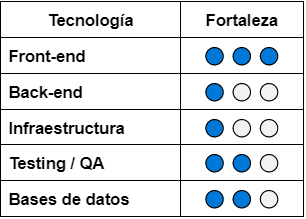
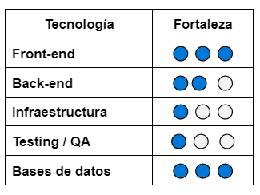
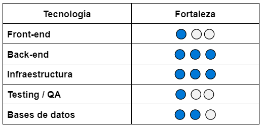
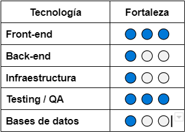
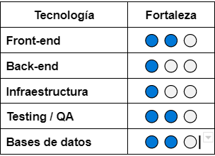
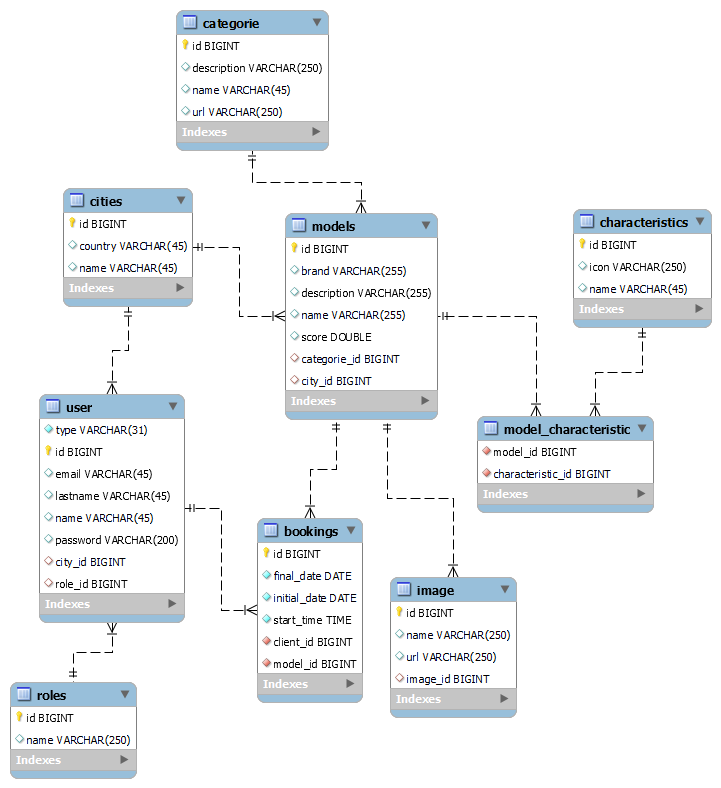

# __DigitalBooking__

## __Resumen__
El proyecto consiste en el desarollo web de una app, aplicando metodologia Agil y Scrum, en la cual son evaluadas tanto las habilidades tecnicas como las blandas.

## __Objetivo__
Nuestro principal objetivo en este proyecto era implementar todo lo aprendido durante el curso, en el cual trabajariamos como un equipo, para así lograr finalizar el producto de la mejor manera.

## __Equipo__

* __Vevis Villalobos__
    * Inicié la carrera en mayo del 2022 sin conocimientos de programación. Hoy puedo decir que la experiencia ha sido todo un desafío pero también ha sido muy valiosa y enriquecedora. 
Durante el proyecto integrador me desempeñé principalmente en el rol de front-end aplicando funcionalidades varias, validación de formularios, eventos y peticiones al servidor. También participé en algunas tareas relacionadas al back-end (creación de tablas, mapeo de  relaciones) y realicé tareas complementarias como analista de base de datos. 
Adjunto una tabla con mis fortalezas en las principales áreas de tecnología de la carrera:

        

* __Lucas Zelaya__
    * Al iniciar la carrera ya contaba con algunos conocimientos mayormente del lado del front-end ya que había realizado distintos cursos de HTML,CSS y JavaScript . Actualmente considero que aprendí muchísimas cosas en la carrera tanto como tecnologías y distintas herramientas o habilidades,especialmente en el proyecto integrador.
Durante el desarrollo del proyecto me vi envuelto mayormente en el área de front-end  y a partir del tercer y cuarto sprint ocupe otros roles como el de back-end y bases de datos.
    
        

* __Fernanda Villacis__
    * Cuando comencé la carrera contaba con conocimientos de programación, ya que estudio la tecnicatura universitaria en programación. Lo que aprendí aquí fueron muchas de las tecnologías que se utilizan actualmente en el mercado (temas que en la universidad no se abordan).
Durante el desarrollo del proyecto integrador me encargue de la infraestructura. Algunas de las principales tareas realizadas fueron el diseño de la red, la creación de la infraestructura en AWS, el despliegue de la aplicación.

        

* __Mauro Diaz__
    * Comencé la carrera con cero conocimiento en programación así que diría que realmente ha sido todo un desafío en donde aprendí cosas que jamás pensé.
Durante el desarrollo del proyecto integrado me desempeñe principalmente como QA donde realice pruebas manuales, clasificación de las mismas, métodos de postman, selenium y redacción de informes
En esta tabla indico las fortalezas actuales en las principales áreas de tecnología de la carrera.

        

* __Axl Stemphelet__
    * Comencé la carrera en mayo de 2022, solo con conocimientos de HTML, CSS y un poco de JS. Durante este proyecto me he desempeñado en diferentes roles, en el primer y segundo sprint como Front-end y tercer y cuarto sprint como Tester/QA.
Adjunto una tabla con mis fortalezas en las principales áreas de tecnología de la carrera: 

        

## __Metodología de trabajo__

Aplicamos la metodología SCRUM, lo que nos permitió encarar el proyecto de una forma mucho más rápida y eficiente.
Nuestra primera fase fue la de planificación, allí establecimos las tareas prioritarias y designamos qué tareas se asignaban a cada miembro del equipo y estimamos el tiempo necesario que cada tarea precisaba para cumplirse.

Agendamos un scrum team meeting diario para evaluar el trabajo que cada miembro iba realizando y detallar si algún problema se había presentado.
La ejecución del proyecto se abordó en 4 sprints de 2 semanas cada uno, y al final de cada sprint, pautamos una sprint review junto al cliente para mostrar los resultados obtenidos, lo que nos permitió estar en un mejoramiento continuo y presentar al final un proyecto adaptado a los requerimientos y necesidades del cliente.  

## __Bitácora del proyecto__

* __Sprint 1:__     Durante la reunión de planificación de este sprint, tuvimos dificultad con la organización del material y no sabíamos cómo dividirnos los roles. A medida de que fuimos avanzando con el proyecto, fuimos conscientes de que no habíamos estimado correctamente el tiempo de culminación de varias tareas, también subestimamos la dificultad de algunas funcionalidades y esto nos tomó por  sorpresa. Al final del sprint, llegamos a la reunión de review sin tareas pendientes por culminar pero bastante estresados y con una lección aprendida.

* __Sprint 2:__     Habíamos decidido comenzar el 2do sprint de una forma más organizada. Por tanto, dedicamos mayor tiempo a la planificación, priorización de tareas y estimación del tiempo para cada una. Nuestro plan de acción fue encarar de manera más productiva la semana, comenzando por las tareas más engorrosas en primera instancia y evitar postergar; de este modo, planeábamos llegar al final del sprint mucho más ligeros de trabajo y con menos estrés. 
Sin embargo, pudimos notar que la dinámica del equipo no era la adecuada, tuvimos dificultad con la comunicación entre nosotros, fallamos en consultar por ayuda cuando lo necesitamos y llegamos a la review con  issues sin culminar

* __Sprint 3:__     Este sprint tuvo un inicio difícil. Al tener varias issues pendientes,  decidimos hacer una reestructuración del equipo y los roles. Sin embargo, la baja cohesión del equipo, sumado a la baja de un compañero a comienzos de la 1era semana, hizo todo muy cuesta arriba.
Tuvimos una reunión de equipo para conversar sobre las dificultades que estábamos presentando y proponer soluciones entre todos. Entendimos que debíamos mejorar nuestra dinámica como equipo y nuestra comunicación si queríamos sacar el proyecto adelante, y así lo hicimos. En esa reunión decidimos darle una reestructuración al proyecto que veníamos armando, y manejarlo desde una perspectiva más simple y funcional, por lo tanto, durante esa primera semana, hicimos varias modificaciones desde el backend para cambiar el modelo del proyecto pero manteniendo la misma temática. Al final del sprint, llegamos a la review con algunas issues sin culminar.

* __Sprint 4:__     Iniciamos el último sprint dándole prioridad a las tareas pendientes por finalizar de los sprints anteriores, también corregimos algunas funcionalidades que habían quedado a la espera de mejoras y luego abordamos las tareas correspondientes al 4to sprint. 
Durante estas 2 semanas estuvimos más coordinados y organizados, también tratamos de estar más comunicados a través de nuestro canal en discord y pudimos llegar a la review final con todas las tareas completadas. 

__Sobre el equipo__

Nuestra debilidad como equipo fue la falta de organización y comunicación. Sin embargo, algo a resaltar es que a pesar del inicio difícil que tuvimos y el impacto que supone la baja de un compañero en la etapa cumbre del proyecto, pudimos adaptarnos a este cambio. 
Asumimos con entereza y disposición el desafío. Nuestra motivación, energía y afán de mejoramiento marcó la diferencia, y de esta forma logramos los objetivos propuestos.

## __Tecnologías utilizadas__

Servicios y herramientas empleados a la hora de realizar el desarrollo:
* Gestión del proyecto: GitLab, Discord.
* Desarrollo del proyecto: 
    * IDEs: Visual Studio Code, Intellij IDEA
    * Sistemas de control de versiones: Git / Gitlab
    * Simulación / Virtualización: AWS

* Qué tecnologías utilizaron para el desarrollo del sitio:
    * Front-End: JavaScript, HTML, CSS, ReactJS, React Router, React-datepicker, Axios, React-Leaflet (mapa).

    * Back-End: Java, Spring, Hibernate, APIs, Rest, Json, Maven, Spring Security, Swagger.

    * Base de datos: MySQL.

    * Infraestructura: EC2, S3.

    * Testing: Postman, Jest, Selenium, Junit.

## __Documentación técnica del proyecto__

### Ambiente de desarrollo

Instrucciones de cómo un nuevo integrante debería armarse su ambiente de desarrollo

* Front-End:
    * Dependencias: Node.js, npm, git.
    * En la terminal, clonar el repositorio.
        * $ git clone repo
    * En la carpeta del front.
        * $ npm i
    * Iniciar el proyecto
        * npm start

* Back-End:
    * Abrir el proyecto en su IDE.
    * Correr la Api.

### Base de datos

* Estructura y diagramas

[]

* Scripts / instrucciones para la creación de la base de datos
https://drive.google.com/file/d/1TLKo2SgMvDMX1dgRSMOmuSTUL4AsFecO/view?usp=sharing
* Scripts / set de datos dummy
https://drive.google.com/file/d/1815mJxddboWLx-FR9KyNbsJeecEBlWm9/view?usp=sharing

### Componentes y diagramas de la aplicación

* Principales partes de la aplicación y cómo se conectan
* APIs disponibles y su documentación (pueden linkear a un sitio externo)

### Infraestructura

* Estructura y diagramas

### Testing y calidad

* https://drive.google.com/file/d/1rHl1WACuBFAMdA-KVXp01c9FMTYNcTig/view?usp=sharing
